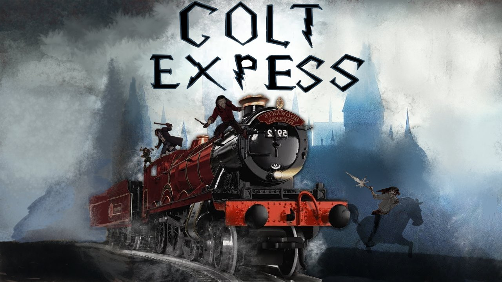

# 🚂 Colt Express - Projet en Python

## Présentation du projet
Ce projet est une version numérique simplifiée du jeu **Colt Express**, développé en **Python** avec **Tkinter** et **Pygame** pour l'interface graphique et les sons. Il permet aux joueurs d'incarner des bandits dans un train en mouvement, où ils doivent récupérer un maximum de butins tout en évitant le Marshall.

---

## Technologies utilisées
- **Python** (Tkinter pour l'interface graphique)
- **PIL (Pillow)** (gestion des images)
- **Pygame** (gestion des sons)
- **OS** (gestion des fichiers)

---

## 📜 Règles du jeu
Le jeu se déroule à bord d'un train avec plusieurs wagons et une locomotive. Les joueurs peuvent :
1. **Se déplacer** d'un wagon à un autre (avant/arrière).
2. **Grimper sur le toit** ou descendre à l'intérieur.
3. **Braquer les passagers** pour voler des butins.
4. **Tirer sur d'autres bandits** pour les forcer à lâcher leur butin.
5. **Éviter le Marshall**, qui patrouille dans le train et tire sur les bandits.

Les **butins** disponibles :
- **Bourses** (100€ ou 200€)
- **Bijoux** (500€)
- **Magot** (1000€ dans la locomotive, protégé par le Marshall)

Le jeu alterne entre :
- **Phase de planification** : chaque joueur choisit secrètement ses actions.
- **Phase d’action** : les actions sont exécutées dans l’ordre planifié.

Le joueur avec **le plus de butin** à la fin de la partie gagne.

---

## 🏗️ Fonctionnalités implémentées
Interface graphique avec représentation du train et des personnages  
Déplacement des bandits (avant/arrière, monter/descendre)  
Gestion des butins (vol, abandon, ramassage)  
Interaction avec le Marshall (tir, fuite sur le toit)  
Système de planification et exécution des actions 
Gestion dynamique de la résolution de l’écran  
Choix de la musique

---

## Installation et exécution
### **1. Prérequis**
Assurez-vous d'avoir **Python 3.8+** installé ainsi que les modules nécessaires :
```bash
pip install pillow pygame
```

### **2. Lancer le jeu**

Exécutez simplement le fichier Python principal :

    python3 ColtExpress.py

### Auteurs

👤 Hullot Dounia

👤 Sophie Bousquet

📅 Université Paris 8 - Programmation d’Interfaces (L2 Informatique)



